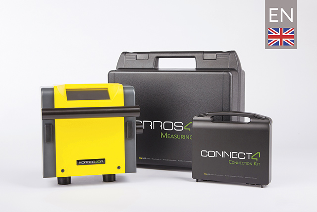

# **Korrostop4.0** - _English information_

## What  is **Korrostop4.0**

_**Korrostop4.0**_ is a reliable, accurate measuring device for measuring conductance, temperature and flow of deionized water after treatment with the _**E.KO IONISER**_ system. [_**Korrostop4.0**_]( https://www.easymetal.com/en/products/korrostop-40/korrostop-40.html) is only approved for use with the [_**E.KO IONISER**_](https://www.easymetal.com/en/products/eko-ioniser/areas-of-application.html) series from [_**easymetal**_](https://www.easymetal.com/) . The use of  _**Korrostop4.0**_ on other deionizing systems is not permitted.  If _**Korrostop4.0**_ is operated illicitly in conjunction with third-party products (deionizing systems), license fees will be incurred as subsequently charged costs which are only covered in conjunction with the _**E.KO IONISER 1501/1502/1503**_ .

Originally designed for industrial use for [water treatment in spark erosion cutting](https://www.easymetal.com/en/custom-solutions/edm/use-in-the-edm-area.html) the  _**E.KO IONISER**_ with _**Korrostop4.0**_ are increasingly being deployed in other areas due to their high quality.

The combination of the _**E.KO IONISER**_ with _**Korrostop4.0**_ is compatible with all EDM machines (independent of make) and with its many communication channels, offers full integration into your existing company IT. _**Korrostop4.0**_ is the ideal measuring device for perfecting process automation within your company. Also see [**Features**](All-Features).

> The current version **SYS412002** was released on 01/28/2020. Also see [Versions](../../wiki/Versions).

## Here, you can find:
* Continuously updated [Informations](../../wiki) about **Korrostop4.0**
* [Updates](Updates) for the SD card update mechanism
* [Specifications](../../wiki) about **Korrostop4.0**
* [Tools and source code](IntegrationSamples) for automation with **Korrostop4.0**
* For other languages, please also refer to the [correspondending repositories](https://github.com/easymetal?tab=repositories)

## Target group of these pages:
* **Interested parties**: Information on features
* **Customers**: Looking up information in the manual, updates, ...
* **[Retailers]( https://www.easymetal.com/en/retailer-locator.html)**: Use cases and reference book for_ customer-specific_ requests
* **Partners**: Use cases & specifications 
* **Developers** in the field of process automation and integration: Examples & specifications

> Picture: **Korrostop4.0** on **E.KO IONISER 1501** 

_© 2020 by [easymetal](https://www.easymetal.com/)_

## QR code links:
* For this page _(https://github.com/easymetal/Korrostop4.0-EN)_: **[Images/qrEN.png](Images/qrEN.png)**
* For the Wiki pages  _(https://github.com/easymetal/Korrostop4.0-EN/wiki)_: **[Images/qrWiki.png](Images/qrWiki.png)**
* For the GitHub pages of easymetal _(https://github.com/easymetal)_: **[Images/qrEasymetal.png](Images/qrEasymetal.png)**
* For the easymetal website _(https://www.easymetal.com/)_: **[Images/qrWEB.png](Images/qrWEB.png)**
